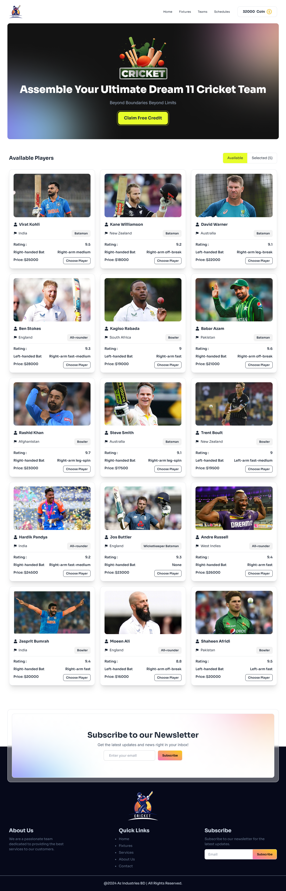
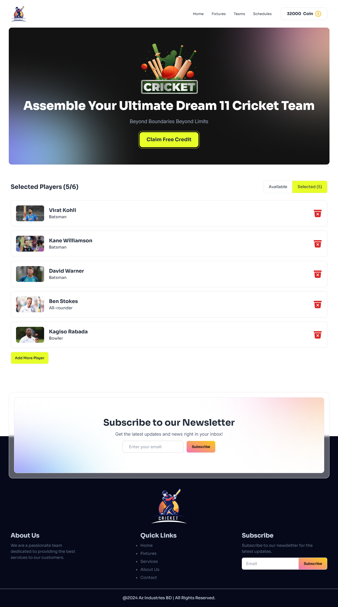

## Live Link

You can see the live site. here is the Link

# [https://bpl-player-selector.netlify.app/](https://bpl-player-selector.netlify.app/)

# [https://bpl-player-selector.surge.sh/](https://bpl-player-selector.surge.sh/)

#  BPL-DREAM 11

**BPL-DREAM11** is a React-based application that lets users build their own virtual cricket team. Users can select players from a pool, manage coins for player purchases, and toggle between available and selected players. The app provides a fun, interactive way to strategize and create the perfect team lineup, following a Figma design and adding engaging interactions and alerts.

---

### Technologies Used

- React (JavaScript framework for building user interfaces)
- React-Toastify (for interactive user notifications)
- CSS (for responsive design and styling)
- JSON (for player data storage) 
- Netlify/Surge (for deployment)

### Key Features

- Interactive Player Selection: Users can browse players, view details, and select them based on available coins, with real-time feedback and coin management.
- Responsive UI: The application adapts seamlessly to various screen sizes, offering a smooth experience on both desktop and mobile devices.
- Real-Time Alerts: Using React-Toastify, the app provides dynamic notifications for coin limitations, player selection limits, and duplicate selections.

# Designs

Page with Available Players

Page with Selected Players

